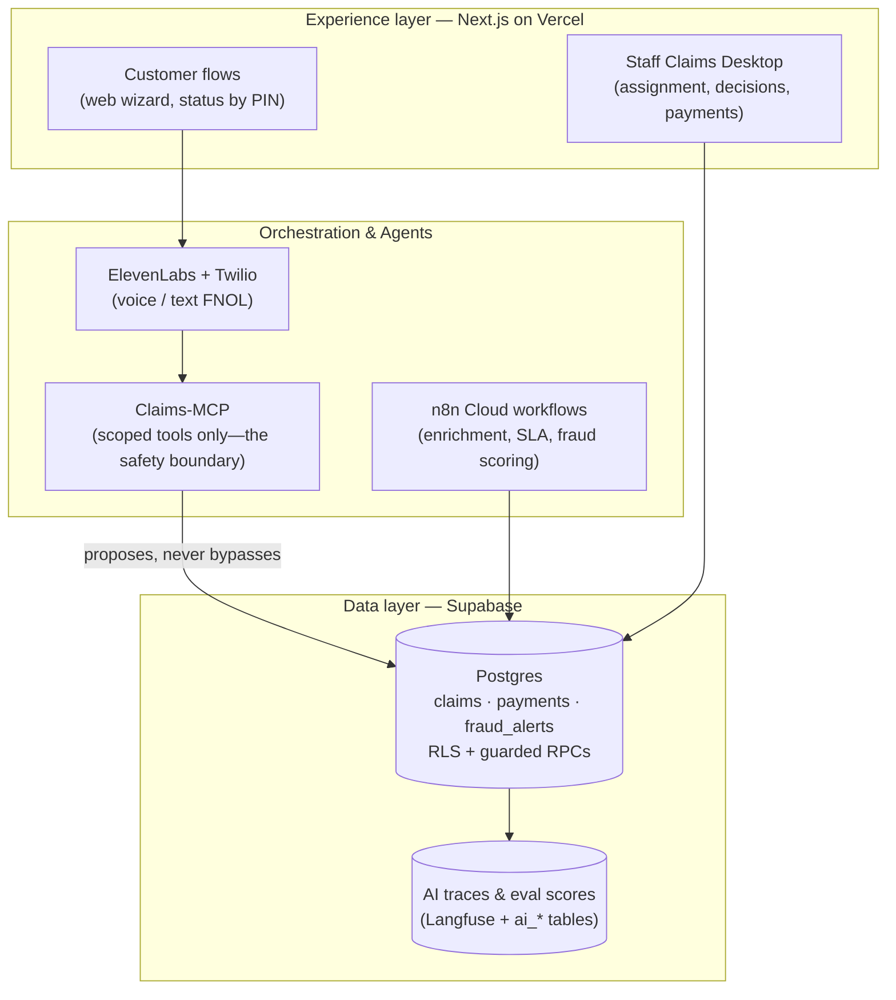

# Property Claims Solution (Showcase)

**This is a trimmed, public showcase of a proprietary product.** Full source is private. This repo contains architecture notes, a demo link, and illustrative code snippets only — not the working application. See [LICENSE.md](./LICENSE.md).

An AI-native claims platform for residential property insurance.

## Problem

Property claims intake and handling is still largely manual and channel-fragmented: customers file by phone, form, or email; adjusters juggle disconnected tools; fraud review happens late and without explainable signals. This project set out to prove that a **full claims management solution** — not a demo chatbot bolted onto a form — could be designed and shipped end to end, with AI doing real work under human control rather than acting as a UI veneer.

## Approach

Customers file FNOL (first notice of loss) by web wizard, voice/text agent, or phone, and get a claim number + PIN to track status. Internal staff work claims through a role- and region-aware Claims Desktop covering the full lifecycle — assignment, investigation, decisions, and payments — with an AI assistant that **proposes** actions for a human to confirm, never acting autonomously on money or denials. A rules-plus-LLM fraud workflow raises explainable alerts and can place a fraud hold that blocks payout until SIU (Special Investigations Unit) clears it. Supabase is the single source of truth; all status changes route through guarded RPCs, and every AI or rules-engine decision is logged and auditable. An observability hub (Health · Quality · Drift) with a golden-dataset eval pipeline and red-team suite ensures AI quality is monitored continuously, not just demoed once.

## Tech stack

- **Frontend:** Next.js (App Router) + TypeScript + Tailwind + shadcn/ui, hosted on Vercel
- **Conversational agents:** ElevenLabs Agents + OpenAI, with Twilio for inbound phone FNOL
- **Agent tools:** a custom Claims-MCP server (hosted on Render) exposing scoped, high-level tools — the agent never touches the database directly or holds the service-role key
- **Orchestration:** n8n Cloud workflows (FNOL enrichment, SLA, fraud scoring), HMAC-signed webhooks
- **Data:** Supabase (Postgres, Auth, Storage, Realtime, RLS, RPCs)
- **Payments:** Stripe Connect (human-approved payouts; stub mode for demos)
- **Observability:** Langfuse + Supabase `ai_*` tables for traces and eval scores
- **Evals:** a dedicated evals harness (golden + red-team suites) running in CI and nightly
- **Tooling:** pnpm + Turborepo monorepo, Playwright E2E, Zod contracts

## Live demo

[property-claims-solution-web.vercel.app](https://property-claims-solution-web.vercel.app)

## Architecture

Three layers with clean seams: an **Experience** layer (Next.js on Vercel) serves both the public customer flows and the internal staff desktop; a **Data** layer (Supabase) holds canonical claim, fraud, and payment state plus AI traces and eval scores; and an **Orchestration/Agents** layer (n8n Cloud for workflows, Claims-MCP on Render + ElevenLabs/Twilio for conversation) handles automation and voice, always writing back to Supabase rather than holding state itself. Claims-MCP acts as the safety boundary — it's the only thing the conversational agent can call, and it exposes purpose-built tools rather than raw database access, so the agent can propose but never bypass a fraud hold or invent coverage.

## Code samples

Three trimmed excerpts from the real codebase, illustrating specific engineering decisions referenced above:

- [`snippets/guarded-status-transition.sql`](./snippets/guarded-status-transition.sql) — the RPC gate that blocks a claim from reaching a payable status while a fraud hold is open
- [`snippets/claims-mcp-scoped-tool.ts`](./snippets/claims-mcp-scoped-tool.ts) — an example Claims-MCP tool definition, showing the scoped-tool safety boundary
- [`snippets/rls-deny-by-default.sql`](./snippets/rls-deny-by-default.sql) — the deny-by-default RLS posture

---

© 2026 Abhishek Mishra. All rights reserved.
